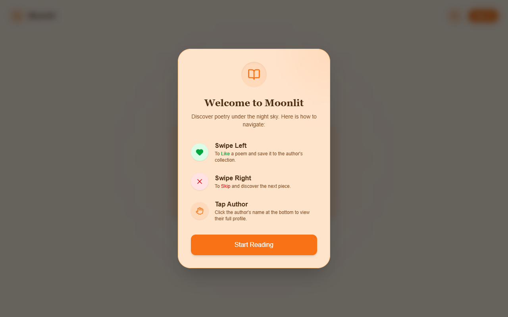
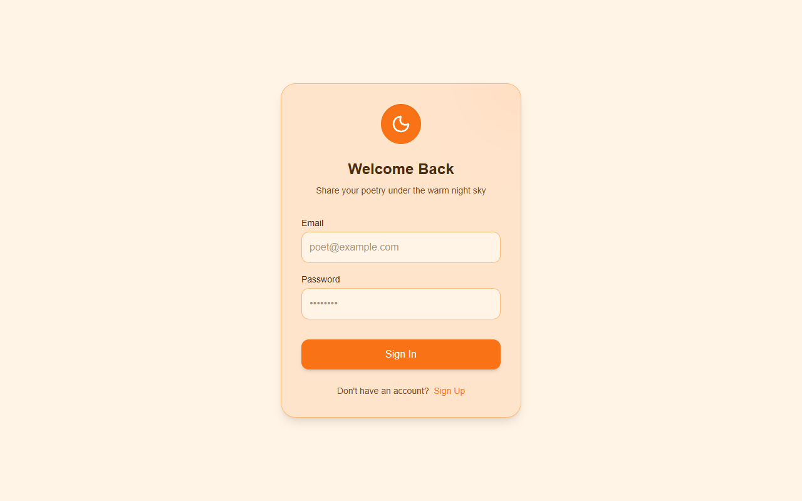

# 🌜 Moonlit Journal



Moonlit Journal is a modern, high-aesthetic poetry discovery application featuring a unique "swipe to discover" interface. Built with a mobile-first philosophy, it allows users to read, like, and follow poets in a minimalist, moonlight-inspired environment. 

## ✨ Key Features

*   **Swipe Discovery**: Tinder-like interface to intuitively discover new poetry. Swipe right to like, swipe left to skip.
*   **Author Following**: Keep track of your favorite poets and see more of their work.
*   **Immersive Guest Experience**: Interactive tutorial overlay for first-time visitors to understand the mechanics immediately.
*   **Glassmorphism UI**: High-aesthetic design utilizing subtle translucency, deep blurs, and moonlit color palettes for a calming reading experience.
*   **Mobile-First Design**: Fully responsive and optimized for touch interactions.
*   **Seamless Authentication**: Secure user login and signup flows powered by Supabase.

## 📸 Screenshots

| Discover New Poems | Login / Register |
| :---: | :---: |
|  |  |


## 🚀 Tech Stack

*   **Framework**: [Next.js 15+](https://nextjs.org/) (App Router)
*   **Language**: [TypeScript](https://www.typescriptlang.org/)
*   **Backend & Database**: [Supabase](https://supabase.com/) (PostgreSQL)
*   **Authentication**: Supabase Auth
*   **Styling**: [Tailwind CSS v4](https://tailwindcss.com/)
*   **Animations**: [Framer Motion](https://www.framer.com/motion/)
*   **Icons**: [Lucide React](https://lucide.dev/)

## 🛠️ Getting Started (Local Development)

Follow these steps to set up the project locally on your machine.

### Prerequisites
*   Node.js (v18 or higher recommended)
*   npm, yarn, or pnpm
*   A [Supabase](https://supabase.com/) account

### 1. Clone the repository

```bash
git clone https://github.com/yourusername/moonlit-journal.git
cd moonlit-journal
```

### 2. Install dependencies

```bash
npm install
```

### 3. Setup Supabase Environment Variables

1.  Create a new project in your Supabase dashboard.
2.  Copy the `.env.local.example` file to `.env.local`.

```bash
cp .env.local.example .env.local
```

3.  Update the `.env.local` file with your actual Supabase URL and Anon Key.

```env
NEXT_PUBLIC_SUPABASE_URL=your_supabase_project_url
NEXT_PUBLIC_SUPABASE_ANON_KEY=your_supabase_anon_key
```

### 4. Database Setup

Run the following SQL queries in your Supabase SQL Editor to set up the required tables:

```sql
-- Create users table (often syncs with auth.users)
create table public.users (
  id uuid references auth.users not null primary key,
  username text unique not null,
  bio text,
  avatar_url text
);

-- Create poems table
create table public.poems (
  id uuid default gen_random_uuid() primary key,
  title text not null,
  content text not null,
  author_id uuid references public.users(id) not null,
  like_count integer default 0,
  created_at timestamp with time zone default timezone('utc'::text, now()) not null
);

-- Create likes table
create table public.likes (
  user_id uuid references public.users(id) not null,
  poem_id uuid references public.poems(id) not null,
  primary key (user_id, poem_id)
);

-- Create follows table
create table public.follows (
  follower_id uuid references public.users(id) not null,
  author_id uuid references public.users(id) not null,
  primary key (follower_id, author_id)
);
```

### 5. Run the development server

```bash
npm run dev
```

Open [http://localhost:3000](http://localhost:3000) with your browser to see the result.

## 🤝 Contributing

Contributions are welcome! Please feel free to submit a Pull Request.

1.  Fork the Project
2.  Create your Feature Branch (`git checkout -b feature/AmazingFeature`)
3.  Commit your Changes (`git commit -m 'Add some AmazingFeature'`)
4.  Push to the Branch (`git push origin feature/AmazingFeature`)
5.  Open a Pull Request

## 📄 License

This project is open-source and available under the [MIT License](LICENSE).
